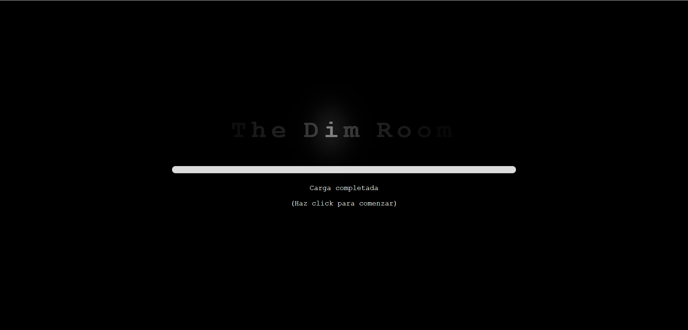
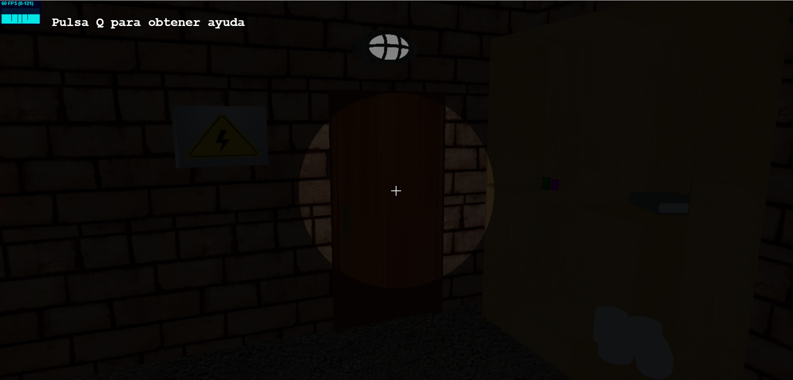
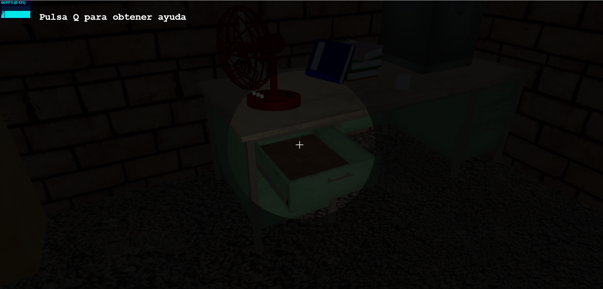
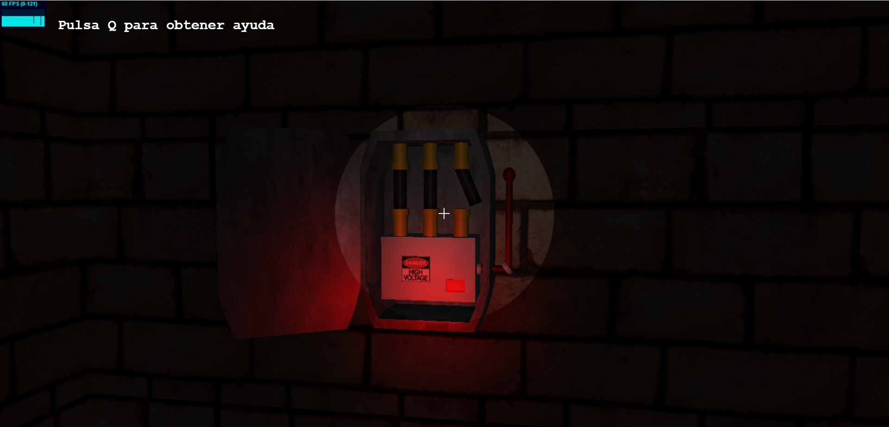
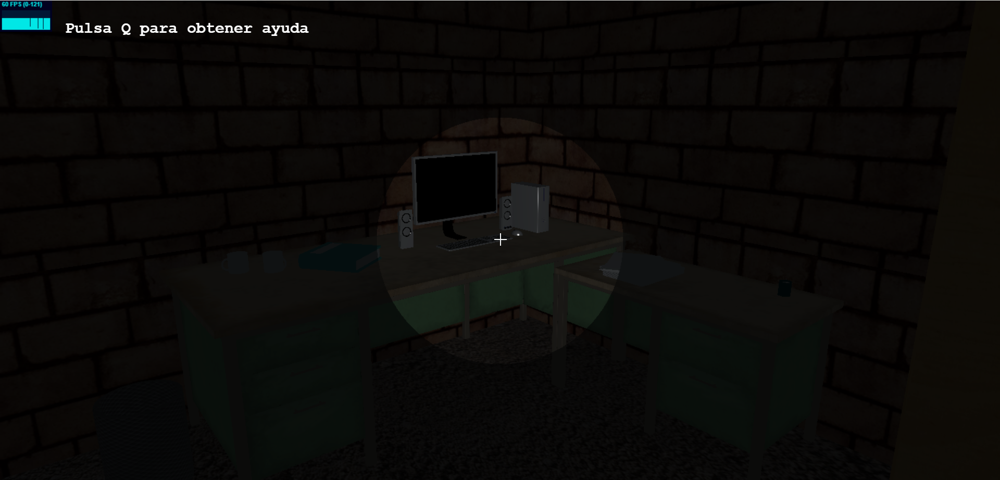
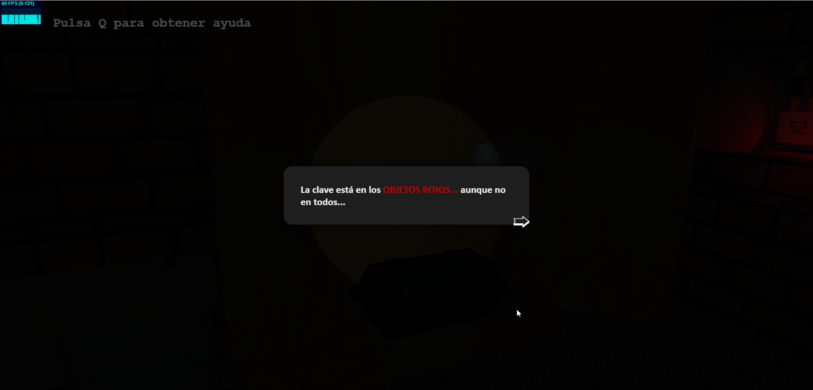

# The Dim Room

## Descripción

Bienvenidxs a **The Dim Room**, un pequeño juego de escape room creado con **WebGL** y **Three.js**. El escape room cuenta con una variedad de puzzles muy sencillos para descubrir cada rincón y elemento de la habitación, así como sus mecánicas. Todos los objetos 3D de la habitación han sido **modelados enteramente por mí**, excepto aquellos mencionados en los [créditos](NOTICE).

Puedes [jugarlo aquí](https://emanuelghdev.github.io/the-dim-room/).

### Acciones disponibles
- Usa el ratón para girar la cámara e interactuar con los objetos de la habitación.

- Utiliza distintas teclas para conseguir más información.

- Muévete a través de la sala con WASD.

¡Resuelve los puzzles para conseguir **abrir la puerta** y lograr escapar!

## Gameplay

## Licencia

Este proyecto está bajo la [Licencia MIT](LICENSE). Siéntete libre de usarlo y modificarlo a tu gusto, así como también es bienvenida cualquier contribución.